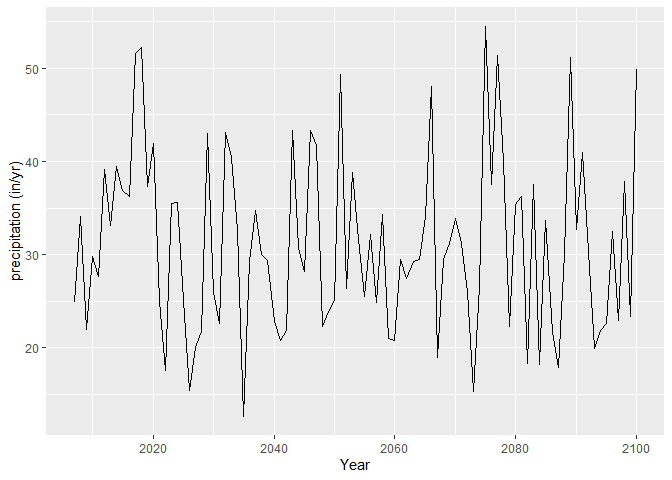
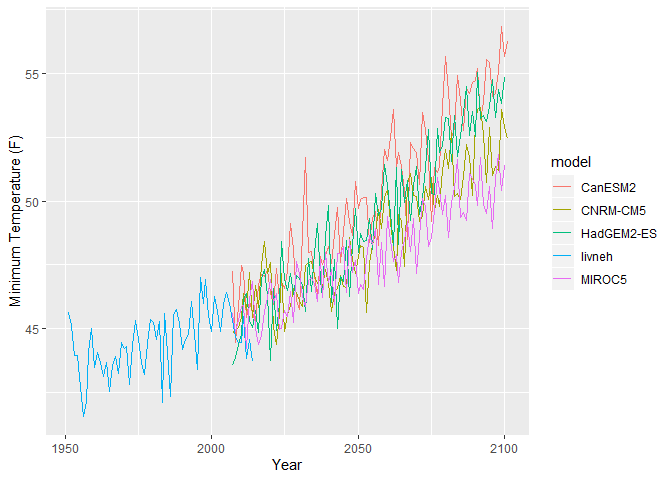

<!-- README.md is generated from README.Rmd. Please edit that file -->

# rcaladapt

<!-- badges: start -->

<!-- badges: end -->

The goal of rcaladapt is to access climate data from Cal-Adapt,
including historical and projected climate data for specific
coordinates.

## Installation

You can install the development version of rcaladapt from
[Github](https://github.com/kdybala/rcaladapt) with:

``` r
devtools::install_github("kdybala/rcaladapt")
```

<!-- You can install the released version of rcaladapt from [CRAN](https://CRAN.R-project.org) with: -->

<!-- ``` r -->

<!-- install.packages("rcaladapt") -->

<!-- ``` -->

## Example

Extract projected annual precipitation for the RCP 4.5 scenario, from
the HadGEM2-ES model, for specific coordinates:

``` r
library(rcaladapt)
example1 <- query_caladapt(var = 'pr', scenario = 'rcp45', model = 'HadGEM2-ES', 
                          coords = '-122.545886,38.248392')
# convert from inches/day to inches/yr
example1$data <- example1$data * 365
head(example1)
#> # A tibble: 6 x 6
#>   index       data variable timestep model      scenario
#>   <date>     <dbl> <chr>    <chr>    <chr>      <chr>   
#> 1 2006-12-31  24.9 pr       year     HadGEM2-ES rcp45   
#> 2 2007-12-31  34.1 pr       year     HadGEM2-ES rcp45   
#> 3 2008-12-31  21.9 pr       year     HadGEM2-ES rcp45   
#> 4 2009-12-31  29.8 pr       year     HadGEM2-ES rcp45   
#> 5 2010-12-31  27.7 pr       year     HadGEM2-ES rcp45   
#> 6 2011-12-31  39.2 pr       year     HadGEM2-ES rcp45
```

The function returns a tibble, to facilitate further analysis and
plotting:



Use purrr::map functions to repeat for several climate models,
scenarios, or variables:

``` r
models <- c('HadGEM2-ES', 'CNRM-CM5', 'CanESM2', 'MIROC5', 'livneh')

example2 <- purrr::map_dfr(models, .f = function(x) {
  query_caladapt(var = 'tasmin', scenario = 'rcp85', model = x, 
                 coords = '-122.545886,38.248392')
})
#> Warning: Expected 4 pieces. Missing pieces filled with `NA` in 64 rows [1,
#> 2, 3, 4, 5, 6, 7, 8, 9, 10, 11, 12, 13, 14, 15, 16, 17, 18, 19, 20, ...].
ggplot(example2, aes(index, data)) + geom_line(aes(color = model)) + 
  ylab('Minimum Temperature (F)') + xlab('Year')
```



<!-- In that case, don't forget to commit and push the resulting figure files, so they display on GitHub! -->
